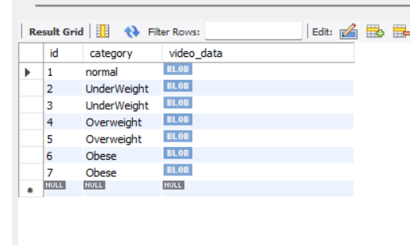

# BMI_Calculator_backend

## Technology Used - Spring Boot

## For Frontend GO through this Link - 
[https://github.com/jitendrapitchuka/BMI_calculator_frontend](https://github.com/jitendrapitchuka/BMI_calculator_frontend)

### Info for DB

I have myself uploaded some meme videos to mysql database . For every category i have loaded the two to three videos which will pick by code randomly by respective category.

## DB SS

#### Spring Boot Api : http://localhost:8080/bmi?weight=0&height=0

